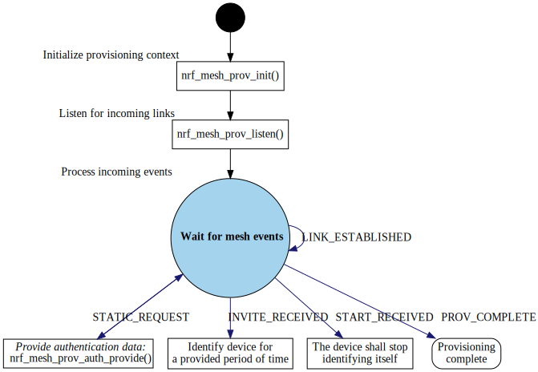
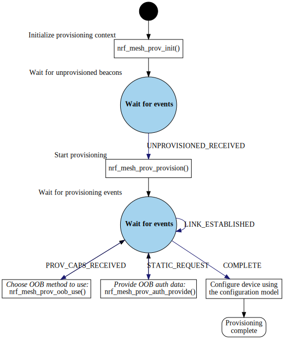

# Provisioning process and APIs

Provisioning is used to provide new devices with the information they need to join
a network. In the provisioning process, a new device is provided with a network key,
an address, and a device key, which is a special key only used for private communication
between the provisioner and the provisionee (for example, when the device is being configured
after provisioning).

A device can be either a provisioner (Provisioner role) or a provisionee (Node role).

**Table of contents**
- [Using the provisioning API](@ref provisioning_using_API)
- [Provisioning procedure](@ref provisioning_procedure)
- [Initialization](@ref provisioning_initialization)
- [Authentication](@ref provisioning_authentication)
- [Provisionees](@ref provisioning_provisionees)
- [Provisioners](@ref provisioning_provisioners)
    - [Standalone provisioners](@ref provisioning_provisioners_standalone)
    - [Serial provisioners](@ref provisioning_provisioners_serial)
        - [ECDH offloading](@ref provisioning_provisioners_serial_ecdh)
    - [Remote provisioning](@ref provisioning_remote)
- [Errors](@ref provisioning_errors) 

---

## Using the provisioning API @anchor provisioning_using_API

The provisioning API provides functions for setting up a provisioner and functions
for setting up a provisionee. You can exclude code for one of the roles if your device
is not using it. To do so, link in only the code for the role that you want the device to support.

If a function is called that is not supported, because the functionality for that role
has not been compiled into the library, an `NRF_ERROR_NOT_SUPPORTED` error is returned.

---

## Provisioning procedure @anchor provisioning_procedure

The following diagram illustrates the provisioning procedure, with all function
calls, messages, and events added.

---

## Initialization @anchor provisioning_initialization

The initialization step is common for both the provisioner and the provisionee role.
In both cases, a provisioning context must be set up. The context maintains the
state of the provisioning process.

The provisioning state is initialized using the `nrf_mesh_prov_init()` function.
The function needs the provisioning context and other related parameters. It is
used to set the initial state of the provisioning context:

* *Public and private keys*: Key pair used for encryption. These keys can be
  preprogrammed or generated using the `nrf_mesh_prov_generate_keys()` function.
  Note that these numbers must be points on a specific elliptic curve, which
  means that regular random numbers cannot be used as a key pair.
* *OOB authentication capabilities*: Used to determine what kind of authentication
  can be used with the node. If no authentication is used, only the `algorithm` field
  must be set.

For example, see `prov_helper_provisioner_init()` in the static provisioner
example (`/examples/light-switch/provisioner/src/provisioner_helper.c`).

For regular mesh devices (i.e. the devices exhibiting the Node role), the initialization of the
provisioning stack is encapsulated by the @ref MESH_STACK.

Note that before using the provisioning stack, the SoftDevice and mesh stack must
be initialized and enabled. As a reference, see `mesh_init()` in the `main.c` file of
the `light-switch\server` example or any other example exhibiting the node role.

---

## Authentication @anchor provisioning_authentication

The provisioning procedure provides several alternatives for out-of-band (OOB)
authentication, which is used to verify that the device being provisioned is indeed
the intended device.

*Static authentication* is the simplest form of OOB authentication. Both provisioner
and provisionee have a static preprogrammed key that is verified during the provisioning
procedure. If the static key matches in both devices, authentication succeeds.

*Input/output authentication* can be used for devices that have input/output capabilities.
During the provisioning procedure, one of the devices is the input device, while
the other is the output device. The output device displays a code (for example, on a
numeric display or by blinking a light) and the user must
input the indicated value into the input device (for example, by pushing a button the
required number of times or entering the value via a keyboard).

Which form of authentication to use is chosen by the provisioner in response
to the `::NRF_MESH_PROV_EVT_CAPS_RECEIVED` event.

If static authentication is chosen,
the application will at some point during the provisioning procedure receive
an `::NRF_MESH_PROV_EVT_STATIC_REQUEST` event. The application should respond
to this event by calling `nrf_mesh_prov_auth_data_provide()` with the static key data.

If input/output authentication is chosen, the input device will receive an
`::NRF_MESH_PROV_EVT_INPUT_REQUEST` event. The application should then request
input from the user and provide this input to the provisioning stack by calling
`nrf_mesh_prov_auth_data_provide()`. The output device will receive an
`::NRF_MESH_PROV_EVT_OUTPUT_REQUEST` event and should then display the provided data
to the user.

---

## Provisionees @anchor provisioning_provisionees

Provisionee behavior with static authentication is handled by the `mesh_provisionee_prov_start()`
API function. However, it is also possible to manually handle provisioning using the provisioning
API if necessary.

The following example assumes that static authentication is used. The steps a provisionee application
must take are as follows:

1. Initialize the provisioning context as described in the "Initialization" section.
2. Start listening for incoming provisioning link requests using the `nrf_mesh_prov_listen()`
   function. This function starts the unprovisioned node broadcast beacon, using the provided
   type of bearer as underlying transport. The advertisement can optionally include a URI
   that points to the location for additional data and a field that specifies the location where
   OOB authentication data can be found.
3. When the provisioning invite has been received, an `::NRF_MESH_PROV_EVT_INVITE_RECEIVED`
   event is passed to the application. When the `nrf_mesh_prov_evt_invite_received_t.attention_duration_s` 
   is set to a non-zero value, the device may identify itself using any means it can. When the attention 
   timer expires, the device stops identifying itself. Incoming link requests will be automatically
   accepted by the device.
4. When the provisioning process has been started, an `::NRF_MESH_PROV_EVT_START_RECEIVED`
   event is passed to the application. The device shall stop identifing itself.
5. When the link has been established, an `::NRF_MESH_PROV_EVT_LINK_ESTABLISHED` event is passed
   to the application.
6. If static authentication is enabled, an `::NRF_MESH_PROV_EVT_STATIC_REQUEST` event is
   passed to the application. The application should respond with the static authentication
   data by passing it to the stack via the `nrf_mesh_prov_auth_data_provide()` function.
   Note that static authentication data is always 16 bytes long.
7. The provisioning can be considered successful when an `::NRF_MESH_PROV_EVT_COMPLETE` event
   is received. This event provides the provisioning data and the device key for the device.
   The received provisioning data must be entered into the device state manager to be used
   by the access layer modules. At this point, the device can receive further configuration
   from the provisioner via the configuration model. The configuration happens automatically
   in the background as long as the configuration model server has been initialized (see the
   Light switch example for an example of how to do this).

---

## Provisioners @anchor provisioning_provisioners

Provisioners are mesh nodes that are responsible for the configuration of other nodes
in the network. Typically, provisioners contain a configuration client and
client nodes for controlling specific functionality in other nodes, such
as lights or air conditioners. Provisioners are often a part of gateway devices,
which are devices that provide a bridge between a mesh network and other networking
technologies (such as the Internet).

There are two main ways of setting up a provisioner:
- running it as a standalone application ([standalone provisioners](@ref provisioning_provisioners_standalone)),
- having it controlled by a host application through a serial interface ([serial provisioners](@ref provisioning_provisioners_serial)).

### Standalone provisioners @anchor provisioning_provisioners_standalone

Standalone provisioners provide provisioning functionality without relying on
an external host. As such, a standalone provisioner must be able to store information about the
provisioned nodes in the network, including their addresses and device keys,
which is necessary for the provisioner to be able to configure the nodes.
Because of the limited amount of memory available in embedded processors, using
a standalone provisioner limits the amount of nodes that can be provisioned,
placing a limit on the maximum size of the mesh network.

The steps that a standalone provisioner application must take to provision a device are
as follows:

1. Initialize the provisioning context as described in the "Initialization" section.
2. Wait for unprovisioned node broadcast beacons. When a beacon is received, the application
   receives an `::NRF_MESH_PROV_EVT_UNPROVISIONED_RECEIVED` event, which contains the UUID for the
   device from which the beacon was received.
3. Establish a link to a device for provisioning using the `nrf_mesh_prov_provision()` function.
4. When the link  to the unprovisioned device has been established, an
   `::NRF_MESH_PROV_EVT_LINK_ESTABLISHED` event is passed to the application.
5. When the out-of-band authentication capabilities of the provisionee have been received, an
   `::NRF_MESH_PROV_EVT_CAPS_RECEIVED` event is received. The application should check the
   capabilities of the provisionee against its own capabilities and decide what kind of
   authentication to do. The authentication method to use is selected using the
   `nrf_mesh_prov_oob_use()` function.
6. If static authentication is enabled, an `::NRF_MESH_PROV_EVT_STATIC_REQUEST` event is
   passed to the application. The application should respond with the static authentication
   data by passing it to the stack through the `nrf_mesh_prov_auth_data_provide()` function.
7. When the provisioning of the device is complete, an `::NRF_MESH_PROV_EVT_COMPLETE` event
   is passed to the application. At this point, the provisioner can continue configuring
   the device using the configuration model. See the Light switch client example application
   for more information on how to do the configuration.

### Serial provisioners @anchor provisioning_provisioners_serial

Serial provisioners use the serial interface to do provisioning, allowing a host
controller to interact with a mesh network using an external microcontroller as a
mesh "modem". In this case, the host controller stores information about the nodes
on the network, freeing up RAM in the external microcontroller for other
application-specific uses. In this case, the size of the mesh network is limited
only by the resources available in the host machine.

The steps to create a serial provisioner application are as follows:

1. Initialize the SoftDevice and mesh stack as usual.
2. Initialize and enable the serial interface, using the `nrf_mesh_serial_init()` and
   `nrf_mesh_serial_enable()` API functions.

Provisioning a device can then be done using the procedure described
under "Standalone provisioners", substituting API calls for
[serial commands](@ref md_doc_libraries_serial_cmd) and events for
[serial events](@ref md_doc_libraries_serial_evt).

#### ECDH offloading @anchor provisioning_provisioners_serial_ecdh

ECDH (Elliptic Curve Diffie-Hellman) is a crytographic algorithm used to securely
create a shared secret between two devices. It is used to create an encryption key,
which is then used for securing the provisioning data as it is being transferred to
the provisionee.

If running multiple provisioners in parallel, you should enable ECDH offloading.
ECDH is a processor-intensive algorithm that can easily become a bottleneck.
ECDH offloading is a feature that lets the host processor calculate the ECDH shared
secret, freeing up CPU resources in the target processor.

ECDH offloading can be enabled by calling @ref mesh_opt_prov_ecdh_offloading_set while
initializing the device.

### Remote provisioning @anchor provisioning_remote

Remote provisioning (PB-Remote) allows a provisioner to provision devices outside its
radio range. This is done by using mesh nodes to relay provisioning messages to a node
within range of the device that is to be provisioned.

The PB-Remote functionality is provided by the PB-Remote client and server models.
More information about remote provisioning and the remote provisioning models can be
found in [the PB-Remote manual](@ref PB_REMOTE).

---

## Errors @anchor provisioning_errors

If an error occurs in the provisioning procedure, the link is closed. An
`::NRF_MESH_PROV_EVT_LINK_CLOSED` event is passed to the application. If an
`::NRF_MESH_PROV_EVT_LINK_CLOSED` event is received before an
`::NRF_MESH_PROV_EVT_COMPLETE` event, the provisioning procedure must be considered
to have failed. The `::NRF_MESH_PROV_EVT_LINK_CLOSED` event also contains a `nrf_mesh_prov_evt_link_closed_t.close_reason`
parameter that can be used to determine what caused the provisioning to fail.

